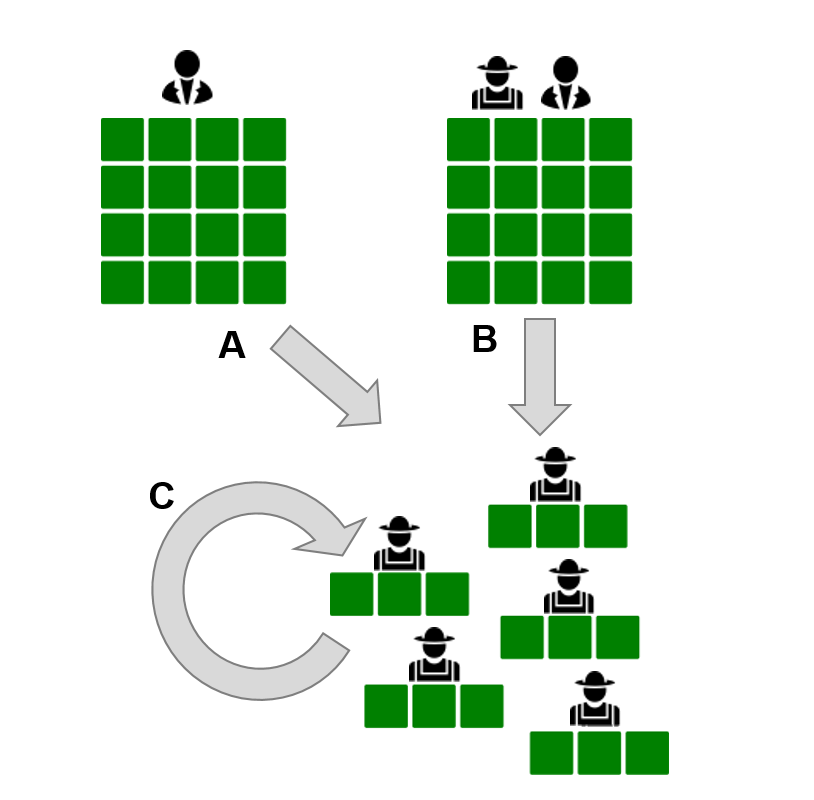
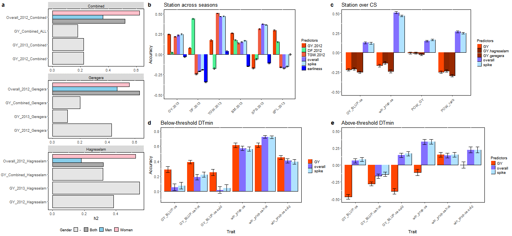
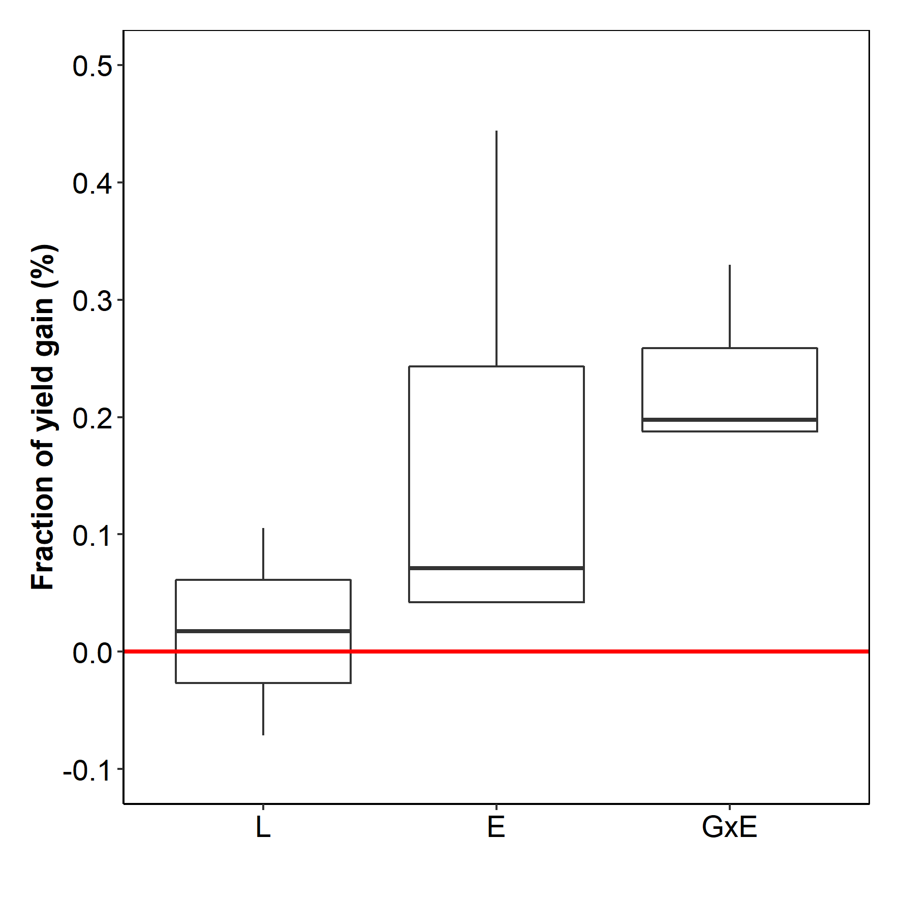

>Kauê de Sousa^1,2^, Jacob van Etten^2^, Jesse Poland^3^, Svein Ø. Solberg^1^, Mario Enrico Pè^4^, Jean-Luc Jannink^5,6^, Yosef Gebrehawaryat^7^, Carlo Fadda^7^, Basazen Fantahun Lakew^4^, Dejene Mengistu^8^, [… add others], Matteo Dell’Acqua^3[*]^  
>^1^ Department of Agricultural Sciences, Inland Norway University of Applied Sciences, 2318 Hamar, Norway  
^2^ Bioversity International, Costa Rica Office, 30501 Turrialba, Costa Rica  
^3^ Department of Agronomy, Kansas State University, KS 66506 Manhattan, USA  
^4^ Institute of Life Sciences, Scuola Superiore Sant’Anna, 56124 Pisa, Italy  
^5^ College of Agriculture and Life Sciences, Cornell University, NY 14853 Ithaca, USA  
^6^ Agricultural Research Service, United States Department of Agriculture, NY 14853 Ithaca, USA  
^7^ Bioversity International, Ethiopia Office, 1000 Addis Ababa, Ethiopia  
^8^ Bioversity International, Nepal Office, 3055 Kathmandu, Nepal  
^[*]^Correspondence should be addressed to MDA (email: <m.dellacqua@santannapisa.it>)

Genomic studies are revolutionizing plant breeding with inexpensive sequencing methods that increases the genetic gain though the evaluation of a broader genetic basis [@Poland2015]. With genomic prediction (GP) approaches in combination with the most recent iterations of artificial intelligence, breeders can speed up the capacity to screen pre-breeding nurseries and develop new varieties with superior traits [@Hickey2019]. Yet, these methods are generally associated with centralized breeding approaches falling short in provide scalable solutions to track genotype by environment (GxE) interactions and to maintain genetic gain [REF]. 

In crop domestication centers, characterized by a high genetic diversity, the centralized breeding can only partially track such interactions preventing the fulfillment of yield potential [REF]. In the Ethiopian highlands, for example, where low input and rainfed durum wheat (*Triticum durum* Desf.) cultivation is conducted since thousands of years with the driving force of smallholder farmers’ choice processes, traditional landraces still show higher performance in their local environment and are preferred over modern varieties [@Kidane2017]. However, with climate change, farmers are pushed to the edge of adaptation capacity. The increasing trends in pest and diseases incidence [@Deutsch2018; @Carvajal-Yepes2019], yield lost [@Challinor2016; @Peng2004; @Ray2012] and seasonal climatic variability [@Cai2014; @Holmgren2013], are some of the challenges faced by smallholders in every growing season. Variety replacement using well adapted genotypes accompanied by recommendations to help match the best technology with their field contexts are among the proposed solutions to cope with these effects [@Challinor2016], but are not well addressed by current centralized breeding methods. 

One solution could come from decentralized approaches outsourcing tasks with the active participation of farmers. Participatory variety selection (PVS) can be used to join farmers’ traditional knowledge to determine the best adapted genotypes [@Mancini2017], while citizen science can track the effects of environment on the varietal performance reducing geographic sampling bias [@vanEtten2019]. When joined with molecular data, these methods may support the identification of genomic loci driving farmers’ preferences. By sourcing farmers’ knowledge, GP-based breeding may effectively capture GxE interactions and improve the capacity of smallholders to address their need for adaptation.  

Here we test a new approach for decentralized breeding (Fig. 1) based on the combination of genomics, PVS and citizen science. We test this idea with durum wheat (wheat for short) across its domestication center and agrobiodiversity hotspot in Ethiopia [@Mengistu2016]. We start from screening a panel of 400 wheat landraces in participatory experimental stations. Farmers provided phenotype evaluation on these landraces in two locations and two growing seasons, evaluations are compared with a centralized (control) trial. Then we move to the experimentation of the top 40 genotypes in 1,077 smallholder farmer trials scattered across Ethiopia (Fig. S1, S2) in a citizen science approach [@vanEtten2019tricot]. We link farmers' evaluation with single nucleotide polymorphisms (SNPs) and environmental data to track genotype performance under real farm conditions. The question that we address is if farmers can predict genotype performance based on their preferences using genomic prediction as a proxy. Then we test if seasonal environmental information associated with molecular markers of genotypes tested in crowdsourcing citizen science can provide robust recommendations maintaining yield gain across growing seasons.  

# Relevance of farmers' metrics in predicting yield performance 

Grain yield (GY) and other yield components are the main drivers of varietal choice by farmers across PVS stations. Farmer's preference of wheat genotypes evaluated in PVS stations have heritability ($H^2$) comparable to that observed in the control trial (Fig. 2A). Within the same experimental setup, yield and farmer choice were positively correlated (Fig. 2B). However, correlations disappeared when comparing traits measured in control station and in the citizen science trials (Fig. 2B). In PVS stations, GY can be predicted across seasons and across locations with an accuracy of 0.25 (Fig. 2C). Days to flowering and thousand grain weight (TGW) show the highest prediction accuracies of 0.43 and 0.51. Even when conducting PVS in a single season and in a single location, farmers can also predict GY across seasons with an accuracy of 0.23. Their evaluation of spike quality predicts TGW with an accuracy of 0.46, slightly lower than that of TGW across seasons. [**add comparison with other studies and discussion**].

When farmers are engaged in PVS, their evaluation of traits is holistic (**SI XX**), and is expressed in likert-based scale driven by their traditional knowledge and preference for wheat traits. From previous studies we expect that farmers are highly skilled in predicting metric traits normally considered by breeding programs [@Mancini2017; @Steinke2017]. When PVS data is used to predict trait values from citizen science trails, the accuracies are much reduced. Grain yield measured in both PVS stations provides a negative prediction of GY and preferences in farmers trails (Fig. 2D). The PVS overall evaluation given on station, however, effectively captures yield observed in farmers trails (r = 0.13) and farmer choice expressed as winning proportion (r = 0.51), probability of winning (r = 0.25), and probability of winning based on yield (r = 0.16), matched by spike PVS scores. [**add comparison with other studies and discussion**] 

# Influence of the environment on prediction ability

We modeled the environmental influence on genotypes performance across citizen science trails, focussing a model with variables derived from seasonal climatic conditions, due to the potential to extrapolate predictions across space and time. We generated a generalized environmental model with citizen science data selecting those climatic variables that contribute to predictivity across seasons. The variables that best represented the structure of this data were minimum day temperature (minDT) and minimum night temperature (minNT), both for the vegetative period (**SI XX**). 

We characterized the locations where tested genotypes were collected to assess the ability of farmers in predicting the performance of genotypes from different climatic regions. Genotypes were classified in cold-adapted (2550 m a.s.l.) and cold-sensitive (2386 m a.s.l.) using minDT. The prediction ability of PVS data for yield components varies depending on the local adaptation of wheat genotypes. The prediction of farmer field performance is improved when considering landraces sampled in cold-adapted regions (Fig. 2E). For this group, GY in station outperforms PVS overall in capturing farmer yields but not in predicting farmer choice regardless of the temperature at the field site. For landraces sampled in cold-sensitive areas, the predictive capacity of station GY becomes negative but PVS overall remains at the same level as for those sampled in cold-adapted areas (Fig. 2F). The local adaption of wheat landraces influences their yield in target environments, yet farmers successfully capture their performance. [**add comparison with other studies and discussion**]

# Genomics improves variety recommendation

Using the citizen science trials, we tested four models with cross-validated Plackett-Luce trees testing the ability of explanatory variables in predict genotypes performance (Fig. 3A). From a previous study [@vanEtten2019], we expected that the environmental model ($M_E$) had the best prediction ability across seasons over an intercept-only ($M_{IO}$) and a location model ($M_L$). Both $M_{IO}$ and $M_L$ presented the least predictive ability (pseudo-$R^2$ = 0.361). Predictive ability from $M_E$ were higher (pseudo-$R^2$ = 0.432) then those observed for $M_L$ and $M_{IO}$, but were surpassed by a model with genotype by environment interaction $M_{GxE}$ (pseudo-$R^2$ = 0.469). In that case the prediction ability is enhanced by applying the genotypes' SNPs markers as a prior associated with the climatic variables from the environmental model. [**add comparison with other studies and discussion**]    

# Improving yields with citizen science 

Predictions from $M_L$, $M_E$ and $M_{GxE}$ were extrapolated to expected grain yield using a bussiness as usual scenario as baseline (Fig. 3B). In this baseline scenario, farmers adopt improved varieties recommended by the Wheat Atlas [REF] in their farms. For the other scenarios, recommendations are based on the expected grain yield from the best three genotypes predicted across a simulated growing season. For the location model, the expected yield is in average above the baseline scenario (2% higher then baseline), but shows weak recommendations for most locations with expected yield bellow the baseline. [**This confirms that improved varieties perform much better when compared with landraces due to geographic sampling bias?**]

Both $M_E$ and $M_{GxE}$ outperformed the expected grain yield for the baseline scenario. The environmental model provides higher gains in some areas but also weak recommendations for some marginal areas. For this model, the expected yield gain oscillate from 4% to 14% when compared to the baseline. Model $M_{GxE}$, provides stable recommendations resulting in expected yield gain from 18% to 33% above the baseline scenario.

We test whether the recommendations from these models can be represented across several growing seasons. We used predictions from a perfect forecast based in 15 growing seasons (Fig. 3C), showing that the $M_{GxE}$ ensure stable recommendations over years with expected yield gain around 20%. [**add comparison with other studies and discussion**]  


# The way ahead 

[conclusion] 


# Materials and methods (goes to supplementary)

## Accessions sampling and DNA extraction 

Durum wheat genotypes were selected from a representative collection of accessions [@Mengistu2016] from the Ethiopian Biodiversity Institute. Genomic DNA was extracted from fresh leaves pooled from five seedlings for each of the accessions with the GenEluteTM Plant Genomic DNA Miniprep Kit (Sigma‐Aldrich, St Louis, USA) following manufacturer’s instructions in the Molecular and Biotechnology Laboratory at Mekelle University, Ethiopia. Genomic DNA was checked for quantity and quality by electrophoresis on 1% agarose gel and NanodropTM 2000 (Thermo Fisher Scientific Inc., Waltham, USA). Genotyping was performed on the Infinium 90k wheat chip at TraitGenetics GmbH (Gatersleben, Germany). Single nucleotide polymorphisms (SNPs) were called using the tetraploid wheat pipeline in GenomeStudio V11 (Illumina, Inc., San Diego, CA, USA). SNP calls were cleaned for quality by filtering positions and samples with failure rate above 80% and heterozygosity above 50%. Full details on the genotyping are given in Mengistu et al. (2016) [@Mengistu2016]. The SNP calls for the genotypes included in this study are given as part of the full dataset on Dataverse [repo]. The details on the on the provinience of genotypes tested are presented as SI XX. 

## Field trials

Station trials with farmers' evaluation were performed in 2012 and 2013 in the districts of Geregera (Amhara) and Hagreselam (Tigray) (Fig. S1). The collection was laid out in a replicated alpha lattice design, and field management was conducted as per local guidelines with manual weeding. Accessions were sown in four rows 2.5 meters long, at a seed rate of 100 kg/ha. At sowing, 100 kg/ha DAP and 50 kg/ha urea were applied, with additional 50 kg/ha urea at tillering. Technicians measured days to 50% booting (DB), days to 50% flowering (DF), and days to 75% maturity (DM) on each plot. Three plants per plot were randomly selected and used to measure number of effective tillers (NET), plant height (PH, in cm), spike length (SPL, in cm), and number of seeds per spike (SPS). Thousand grain weight (TGW; weight of 1,000 kernels, in grams), grain yield (GY, grams of grain produced per plot, converted in t/ha), and above ground biomass (BM; dry weight of the above ground harvested biomass grams per plot, in t/ha) were measured on full plots. Thirty experienced smallholder farmers growing wheat (15 men and 15 women) were invited to participate in the trial evaluations at the station plots, held concurrently at the flowering stage the respective growing season. The farmers had no previous knowledge of the varieties included in this study to prevent induced bias in the evaluations. The participants provided appraisal with Likert scales (1 to 5 worse to best) [@Likert1932] given to genotypes for overall appreciation and other agronomic traits (spike length, tillering, earliness and grain yield) [@Mancini2017].

Citizen science on-farm trials were performed between 2013 and 2015 during three cropping seasons across the regions of Amhara, Oromia and Tigray in Ethiopia (Fig. S1) using a subset of the best genotypes identified in 2012's evaluation of station trials. Trial design followed the tricot citizen science approach [@vanEtten2019tricot]. Sets of four genotypes were allocated randomly to farmers as incomplete blocks, maintaining spatial balance by assigning roughly equal frequencies of the genotypes to each area. Plots were small to facilitate farmer participation, but in all cases large enough to avoid strong edge effects. Farmers set, managed and evaluated their own experiments indicating, via pre-defined answer forms [@vanEtten2019tricot], the relative performance of genotypes through ranking (1 to 4, best to worst). We focused on farmers' overall evaluation of genotypes. Overall performance ranking had a strong correlation with farmers' ranking of yield (Kendall rank correlation coefficient of 0.97).

## Environmental data

We used free, publicly available environmental data with coverage across the tropics. Fourteen environmental variables (rainfall and temperature) were extracted for the vegetative, flowering and grain filling periods starting on the planting date of each observation point, following the procedure described by van Etten (2019) [@vanEtten2019], which applies a forward selection using the seasons as bins to train and test the model looking for the variables that best represent the environmental structure of the region. The variables selected under this procedure were: *(i)* maxNT, maximum night temperature ($^\circ$C) and; *(ii)* minNT, minimum night temperature ($^\circ$C) for the vegetative cycle. Both indices were calculate using the temperature data from the NASA Langley Research Center Atmospheric Science Data Center Surface meteorological and Solar Energy (SSE) web portal supported by the NASA LaRC POWER Project (https://power.larc.nasa.gov/). These indices were previously used for the environmental analysis of wheat trials [@Kehel2016].

## Data analysis 

All analysis were done in R [@RCoreTeam2017]. Metric traits and farmer traits collected in station trials were used to derive best linear unbiased prediction (BLUP) values using the R package ASReml [@Gilmour2015] with the following model: 

Equation [1]
$$ y_{ijk} = \mu + g_i + m_j + r_k + gm_{ij} + mr_{jk} + gmr_{ijk} + e_{ijk} $$

Where $y_{ijk}$ is the adjust trait value, $\mu$ is the overall mean, $g_i$ is the random genotype effect for each tested line, $m_j$ is the random effect for each jth year, $r_k$ is the random effect for each *k*^th^ location, $gm_{ij}$ is the random interaction effect between year *j* and genotype *i*, $mr_{jk}$ is the random interaction between year $j$ and location *k*, $gmr_{ijk}$ is the random interaction between genotype *I*, year *j*, and location *k*, and $e_{ijk}$ is the random error. 

Broad sense heritability ($H^2$) was calculated within and across each year and station on a line-mean basis using the equation: 

Equation [2]
$$ H^2 = \frac{\sigma^2_g}{(\sigma^2_g + \frac{\sigma^2_y}{y} + \frac{\sigma^2_e}{r} )} $$

Where $\sigma^2_g$ is the genotypic variance, $\sigma^2_y$  is the year variance, $\sigma^2_e$ is the residual variance, *y* is the number of years and *r* is the number of replicates.

Genomic prediction models and marker-based genetic relationship matrices were computed on BLUP data using the package rrBLUP [@Endelman2011]. The following prediction scenarios were considered: i) first year (2012) station data over second year (2013) station data; ii) station data over on-farm trials; iii) farmer traits over metric traits. Subsamples were taken on the basis of the results deriving from other analyses, e.g. depending on maxNT and miNT at their sampling locations or at the locations in which they have been phenotyped. For all prediction scenarios, cross-validation [@Daetwyler2013] was conducted by randomly extracting a training set comprising 70% of the sample size and running the prediction on a test set comprising the rest accessions. We used a 100-fold cross-validation, and prediction accuracy in each was assessed as the Pearson’s correlation between the predicted values and true values measured on the test set. Reported values are the mean and standard deviation of the random partitions deriving from the cross-validation procedure.

We used an implementation of Plackett-Luce model [@Plackett1975; @Luce1959] in R [@PlackettLuce], to analyse the data generated by the citizen science on-farm trials. The Plackett-Luce model estimates for each genotype the probability that it wins, against all other genotypes in the set. The model determines the values of positive-valued pa|rameters $\alpha_{i}$ (worth) associated with each variety $i$. These parameters $\alpha$ are related to the probability that variety $i$ wins against all other $n$ genotypes in the following way.

Equation [3]
$$P(i \succ \{j, ..., n\}) = \frac{a_i}{a_1 + ... + a_n} $$

The probability that variety $i$ beats another variety $j$ is calculated in a similar way.

Equation [4]
$$P(i \succ j) = \frac{a_i}{a_1 + a_j} $$


Equation [4] also serves to calculate the reliability of a genotype -- its probability of beating a check variety  [@Eskridge1992]. These equations follow from Luce’s Choice Axiom, which states that the probability that one item beats another is independent from the presence or absence of any other items in the set  [@Luce1959]. We report worth values that sum to 1. This makes each worth value $\alpha_i$ equal to the probability of variety $i$ outperforming all other genotypes. 

Equation [5]
$$P(i \succ \{j, ..., n\}) = \frac{a_i}{a_1 + ... + a_n} = \frac{a_i}{1} = a_i$$

To take into account explanatory variables, we created Plackett-Luce Trees (PLT) through recursive partitioning  [@Strobl2011]. For recursive partitioning with the PLT we used the variables described in the previous section. The PLT models had a cut-off value of p = 0.01 and a minimal group size of 20 percent of the total dataset partitioning selection. We used the PLT models with four approaches using a 100-fold cross-validation: *(i)* an intercept-only model ($M_{IO}$); *(ii)* a location model ($M_L$), which included the longitude and latitude of trial locations in the analysis, as well as the coordinates on 45$^{\circ}$ rotated axes; *(iii)* an environmental model ($M_E$), which included the environmental variables selected in the forward algorithm; and *(iv)* a genotype by environment model ($M_{GxE}$), which uses an additive matrix derived from the genotypes' SNP values as a prior for the environmental model. Models were compared using cross-validated (out-of-sample) deviance (instead of Akaike Information Criterion), because it better reflects the complexity of the full modeling procedure [@Elder2003]. To generate Fig. 3A, we calculated pseudo-$R^2$ values that represent the relative reduction in deviance of the model [@Agresti2002].

We evaluated if the models obtained with the variable selection procedure retained predictive power when no seasonal climate data was available for the testing season. We prepared representative seasonal scenarios of past climate conditions of each site by extracting the last 15 years of seasonal climate data derived from the NASA POWER (2001-2015). We determined three windows for sowing dates in each growing season as the midpoints of equiprobable quantile intervals estimated from the observed planting dates in the data set. We predicted variety performance for 15 seasons * 3 sowing dates (45 seasonal scenarios) for 1200 random points generated across an alpha hull area within the range of the trials coordinates. We averaged genotype probability of winning across these scenarios for each planting date interval, excluding the seasons used as testing data. We combined the observed yield from the station data to derive the the expected yield gain of adopting the recommendations produced by the tested models. 

To examine the origin of cold tolerance genotypes, we created a group with cold-adapted and cold-sensitive genotypes from the results of the generalizable PLT model (excluding modern varieties). Genotypes were classified as cold-adapted if above-average in node 2 and below-average in node 3 and as cold-sensitive if below-average in node 2 and above-average in node 3. We performed a one-tailed, unequal-variance t-test to determine differences in elevation between the two groups [@Welch1947].

Organizing the datasets relied on R packages ClimMobTools [@climmobtools] and tidyverse [@tidyverse]. Statistical analysis was performed using packages [...]. Pearson correlations across station and on-farm traits were visualized with corrplot [@corrplot]. Forward variable selection depended on packages[...]. Genomic prediction was performed with packages [...]. For geospatial analysis we used the packages [...].

## Data and code availability

Full data is available through Dataverse [**create repo with Bioversity Dataverse; put the GitHub link in the description**].


\newpage

# Display items

```{r, fig.cap="**Fig. 1.** Centralized trials (**A**) derives recommendations from breeders evaluation and some participatory assessments which are geographically biased. We propose an approach (**B**) where breeders and farmers select the best candidate genotypes to be tested on-farm in small, blinded and randomized sets of genotypes producing scalable solutions that can be linked to environmental data and the interactions between genotypes and environment.", fig.margin=TRUE, echo=FALSE}

```

\newpage

```{r, fig.cap="**Fig. 2.** Trait values and predictions on-station and in crowdsourcing fields. (A) Broad sense heritabilities for PVS overall evaluation compared with those of yield in stations and across stations and years. PVS overall is highly heritable, and is influenced by gender and location. (B) Spearman correlations among traits. Non-significant correlations are not shown; in the upper triangle of the symmetric matrix, significance is corrected for multiple testing. In the lower triangle, significance is considered on a single-test basis. (C) Bar plot representing accuracy of on-station and across season genomic predictions. Predicted traits are reported on the x axis, and predictors are coded by colors according to the legend to the right. (D) Bar plot representing accuracy of genomic prediction when using station data as a predictor of farmer fields’ data. (E) Bar plot representing accuracy of genomic prediction when using station data as a predictor of farmer fields’ data, limiting the dataset to landraces originally sampled in locations with minimum day temperature (minDT) lower than the splitting value. (F) As in previous panel, but limiting the dataset to landraces originally sampled in locations with minimum day temperature (minDT) higher than the splitting value.", echo=FALSE, fig.height=1, fig.margin=TRUE, fig.width=1}

```

\newpage

```{r, fig.cap="**Fig. 3.**. Model performance and modelled yield gain for durum wheat genotypes in Ethiopia based on farmers' evaluation in a citizen science method. (**A**) Goodness of fit (pseudo-R^2^) of Plackett-Luce trees determined with 100-fold cross-validation for the intercept-only (IO), location (L), environmental (E) and genotype by environment (GxE) models. (**B**) Expected yield gain of adopting variety recommendations based on location (L), environmental (E) and genotype by environment (GxE) models across growing seasons in Ethiopia. Red line represents the baseline for expected yield of recommended genotypes based on the Wheat Atlas. (**C**) Predicted yield gain across 15 growing seasons (2001 to 2015) in Ethiopia for the environmental (E) and genotype by environment (GxE) model.", fig.margin=TRUE, echo=FALSE, fig.height=5, fig.width=5}

```

\newpage
# Acknowledgements
We thank all farmers who evaluated the genotypes. **[Others, Seeds4Needs?? Other Sant'Anna project contracts??]**. This work was implemented as part of the CGIAR Research Program on Climate Change, Agriculture and Food Security (CCAFS), which is carried out with support from the CGIAR Trust Fund and through bilateral funding agreements. For details please visit https://ccafs.cgiar.org/donors. The views expressed in this document cannot be taken to reflect the official opinions of these organizations. 

# Author contributions
MDA, JvE, JP, KdS, SØS, JLJ and MEP designed research; CF, YG, DM, BFM, performed field research; MDA, JP and KdS analyzed the data; [...]

# Conflict of interests
The authors declare no conflict of interests.

# References